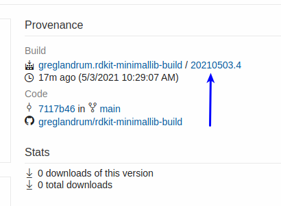
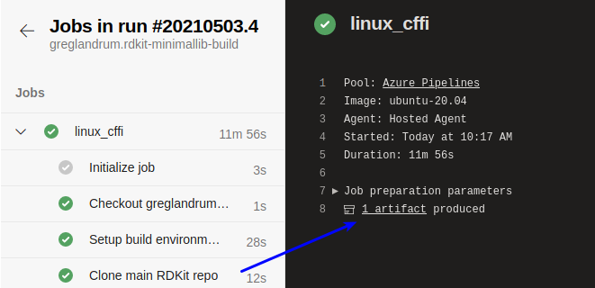
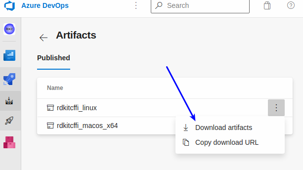

---
aliases:
- /technical/2021/05/01/rdkit-cffi-part1.html
categories:
- technical
date: '2021-05-01'
description: Introducing the RDKit CFFI interface
layout: post
title: A new way to use the RDKit from other languages
toc: true

---

# TL;DR

We've added a new API which makes it easy to use the RDKit from programming languages other than C++, Python, Java or C#.

# Intro

The majority of the RDKit is written in C++, but we also make wrappers allowing
you to use it from other programming languages. The main one of these, and the
most complete, is for Python and is written by hand (using Boost::Python). The
Java and C# wrappers are generated more or less automatically using SWIG.

Back in 2019 we decided to do a JavaScript (JS) wrapper which follows a slightly
different approach: instead of wrapping the whole toolkit the new JS wrappers
provide access to a useful subset of RDKit functionality provided as functions.
We called this `MinimalLib` and there's more information in an [earlier blog
post](http://rdkit.blogspot.com/2019/11/introducing-new-rdkit-javascript.html).

We've now extended `MinimalLib` and made it useable from any programming
language which supports calling into external libraries written in C (often
called using a "C Foreign Function Interface", or CFFI). Since most common
programming languages support CFFI, I think this will help bring chemistry to a
bunch of other languages.

# How it works

This is easiest explained with an example. Since each programming language
implements CFFI slightly differently, and I'm not even close to being good at
some of the more intersting ones like go, Rust, or Julia, I'll demonstrate using
C itself and sample code adapted from
[cffi_test.c](https://github.com/rdkit/rdkit/blob/master/Code/MinimalLib/cffi_test.c),
one of the files used to test the new interface.

The general pattern when working with rdkit-cffi is to parse a molecule input
format to get back a serialized ("pickled") form of that molecule and then to
pass that pickled molecule to other functions which do the chemistry operations
you're interested in.

## Parsing molecule formats and operating on molecules

The "hello world" equivalent in cheminformatics is generating canonical SMILES. Here's a full C program showing how you do that with rdkit-cffi, I will explain the rdkit-cffi functions and how they are used in more detail below:

```
#include <stdio.h>
#include <string.h>
#include <stdlib.h>
#include "cffiwrapper.h"

void canon_smiles(){
  char *pkl;
  size_t pkl_size;
  
  pkl = get_mol("c1cc(O)ccc1",&pkl_size,"");
  char *smiles=get_smiles(pkl,pkl_size,NULL);
  printf("Canonical SMILES: %s\n",smiles);
  free(smiles);
  free(pkl);
}

int main(){
  enable_logging();
  printf("hello %s\n",version()); 
  canon_smiles();
  return 0;
}
```

I compiled this on my linux machine as follows:
```
% cc -o demo.exe -I $RDBASE/Code demo.c $RDBASE/lib/librdkitcffi.so
```
Running it produces:
```
% ./demo.exe
hello 2021.09.1pre
Canonical SMILES: Oc1ccccc1
```

Let's look at the rdkit-cffi parts of this, starting with the `main()` function.

We start by enabling the RDKit's logging system:
```
  enable_logging();
```
If you skip this, you won't see any of the usual RDKit errors or warnings.

Next we use the `version()` function to get the version of the RDKit which is being used and then print that out.

With that basic initialization out of the way we call the function `canon_smiles()`, which is where the real work happens. 
Here we start by parsing a SMILES using the `get_mol()` function:
```
  pkl = get_mol("c1cc(O)ccc1",&pkl_size,"");

```
`get_mol()` returns a binary string with the pickled representation of the
molecule and uses the `pkl_size` argument (an integer) to return the length of
that string (this is an unfortunately necessary implementation detail). The
final argument to `get_mol()`, the empty string, can be used to pass in an JSON
string containing additional arguments controlling the parsing (we could have
also passed this argument as NULL). `get_mol()` currently supports constructing
molecules from SMILES (and CXSMILES), Mol/SDF, and the RDKit's JSON format; it
recognized automatically which parser should be used. We will be expanding the
list of supported formats in the future.

After we have the molecule processed we can get the canonical SMILES for it by
calling the `get_smiles()` function:
```
  char *smiles=get_smiles(pkl,pkl_size,NULL);
```
`get_smiles()` follows the general pattern for rdkit-cffi functions which
operate on molecules: the first two arguments are the pickled molecule and the
length of the pickle string, the third argument is a JSON string with additional
options to be used when generating the SMILES; in this case we want the
defaults, so we pass a NULL pointer (we could also have used the empty string
`""`).

Finally, and not to be overlooked when working in C, we need to free the memory
which was allocated to hold the molecule pickle and the SMILES:
```
  free(smiles);
  free(pkl);
```

The functions which are available are declared in [cffiwrapper.h](https://github.com/rdkit/rdkit/blob/master/Code/MinimalLib/cffiwrapper.h). 


## Modifying molecules

Some rdkit-cffi functions modify the molecule. In this case the general pattern
is the modify the molecule *in place*, i.e. to modify the current molecule
instead of returning a new one.

Here's a simple function which parses a SMILES, add Hs to the molecule,
generates a 3D conformer using a fixed random seed, and then prints out the
molblock for the modified molecule:
```
void generate_conformer(){
  char *pkl;
  size_t pkl_size;
  
  pkl = get_mol("c1cc(O)ccc1",&pkl_size,NULL);

  add_hs(&pkl,&pkl_size);

  set_3d_coords(&pkl,&pkl_size,"{\"randomSeed\":42}");

  char *molb = get_molblock(pkl,pkl_size,NULL);
  printf("%s\n",molb);
  free(molb);
  free(pkl);
}
```
We've already seen `get_mol()`. As mentioned above `add_hs()` modifies the
molecule in place, so you need to pass pointers to the pickle string and pickle
size so that they can be modifed. `set_3d_coords()` also modifies the molecule
in place to add the conformer. This is also the first time we use the JSON
string that most of the functions take as their last argument: here we set the
random number seed used in the conformer generation so that we get reproducible
results. Finally `get_molblock()`, like `get_smiles()`, returns a string with
the MOL file data for the molecule. This can be saved to a file and opened in
most chemistry software.


# An aside about an interesting way rdkit-cffi could be used

The RDKit has a lot of functionality, and covering all of that in the interface
exposed by `rdkit-cffi` is not a goal. We want to provide a useful (hopefully
very useful) subset of the functionality for use in other languages. If there's
something you think is missing, please [ask about
it](https://github.com/rdkit/rdkit/discussions).

I think you there's another interesting use case for this though. Suppose you
have an idea for some interesting new piece of cheminformatics functionality,
and you'd like to work in a language like Rust or Julia but you don't want to
have to deal with all the basic cheminformatics plumbing yourself. `rdkit-cffi`
can really help here. The key functionality for this mode is the `get_json()`
function, which returns an easily parsed JSON representation of the molecule
using the RDKit's extension to the [commonchem JSON
format](https://github.com/CommonChem/CommonChem).

```
void json_output(){
  char *pkl;
  size_t pkl_size;
  
  pkl = get_mol("c1cc(O)ccc1",&pkl_size,"");
  char *json=get_json(pkl,pkl_size,NULL);
  printf("%s\n",json);
  free(json);
  free(pkl);
}
```
The output here (after running through a JSON pretty printer) is:
```
{
  "commonchem": {
    "version": 10
  },
  "defaults": {
    "atom": {
      "z": 6,
      "impHs": 0,
      "chg": 0,
      "nRad": 0,
      "isotope": 0,
      "stereo": "unspecified"
    },
    "bond": {
      "bo": 1,
      "stereo": "unspecified"
    }
  },
  "molecules": [
    {
      "atoms": [
        {
          "impHs": 1
        },
        {
          "impHs": 1
        },
        {},
        {
          "z": 8,
          "impHs": 1
        },
        {
          "impHs": 1
        },
        {
          "impHs": 1
        },
        {
          "impHs": 1
        }
      ],
      "bonds": [
        {
          "bo": 2,
          "atoms": [0,1]
        },
        {
          "atoms": [1,2]
        },
        {
          "atoms": [2,3]
        },
        {
          "bo": 2,
          "atoms": [2,4]
        },
        {
          "atoms": [4,5]
        },
        {
          "bo": 2,
          "atoms": [5,6]
        },
        {
          "atoms": [6,0]
        }
      ],
      "extensions": [
        {
          "name": "rdkitRepresentation",
          "formatVersion": 1,
          "toolkitVersion": "2021.09.1pre",
          "aromaticAtoms": [0,1,2,4,5,6],
          "aromaticBonds": [0,1,3,4,5,6],
          "atomRings": [[0,6,5,4,2,1]
          ]
        }
      ]
    }
  ]
}
```
It should be easy to parse this with the JSON parser in any modern programming
language, and the format provides all the information you need to reconstruct a
molecule in whatever representation you're using in your language of choice. But
you can do it without having to worry about dealing with chemistry perception,
ring finding, etc.


# Status

The new CFFI interface is currently available on the RDKit master branch. It
hasn't yet been officially released, but I'm publicizing it now because I'd like to
try and get people using it and providing feedback and suggestions so that we
can get it as polished and useful as possible before the 2021.09 release later
this year.

I've setup a [separate repo in
github](https://github.com/greglandrum/rdkit-minimallib-build) which has a link
to Azure Pipelines to automatically do builds of the CFFI wrappers and make the
shared libraries available. The README there also includes links you can use to
download the most recent builds for Linux and the Mac (I still need to get the
automated Windows builds working). I haven't figured out how to actually make
this easy (unless you have the azure CLI installed, in which case there's a
single command you can execute), so there are a number of clicks needed:

Start by picking the build you want from the README:


Now click the build identifier (this page also has the azure CLI command to get the build directly):


Pick the appropriate job:


Click the "1 artifact" link:


now you can actually download the artifact:


_sigh_ I will try to find a way to make this simpler...

# Wrapping up

I will likely do another post on rdkit-cffi before the next release, most likely
one looking at things like performance (since that's something I tend to do). In
the meantime please let me know if you start using it!
