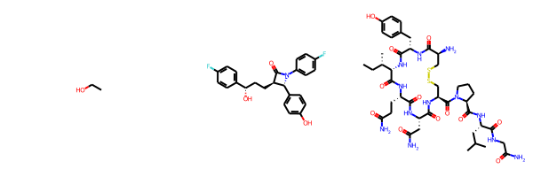
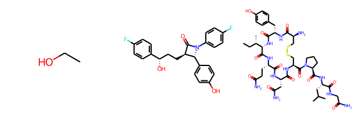
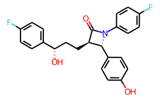
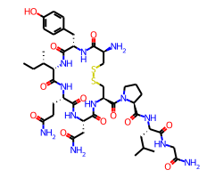
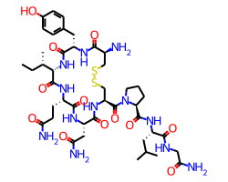
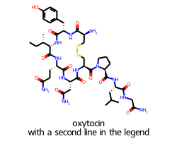
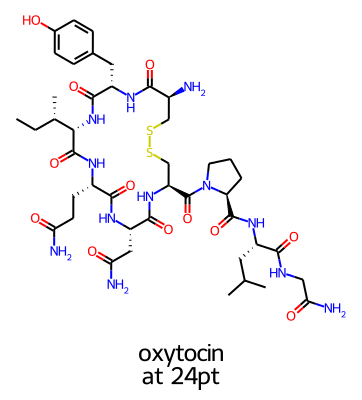

---
aliases:
- /technical/2022/03/18/refactoring-moldraw2d.html
categories:
- technical
date: '2022-03-18'
description: A bit of rambling and an overview of some new features
layout: post
title: Some thoughts on refactoring the MolDraw2D code
toc: true

---

*The functionality described here is available in the 2022.03.1 and later releases of the RDKit*

# Intro

I recently merged a pull request (https://github.com/rdkit/rdkit/pull/4948) from Dave Cosgrove with some pretty significant changes (58 modified files and >8000 modified lines of code according to Github) to the backend MolDraw2D code. Dave and I have been working on this (well, ok, Dave has been working, I’ve been commenting on his work ;-) ) for a couple of months.

Given the amount of effort that went into this PR, and how happy I am about it, it may be somewhat surprising to hear that I hope that most of these changes will remain more or less invisible to most of the RDKit community. All existing code and scripts should continue to work without modification, though there may be some small changes (I hope they are improvements) to the way molecules are actually drawn; see below for more information on this.

# Why do something like this?

The MolDraw2D code is heavily used and, in my opinion, pretty important. Over the last few years it had also gotten pretty complex and difficult to maintain. Some of that complexity is inevitable, the rendering code is quite flexible and is solving a non-trivial problem, but a lot of it was also due to the incremental addition of features over time. This “accidental” complexity made both extending and fixing the code more difficult. So at the end of 2021 when Dave had time to do a chunk of work on the RDKit and T5 Informatics had some funds available, we took what we’ve learned over the past years and Dave rewrote the backend. The goal was to clean things up and make the code more extensible and maintainable without breaking existing code.

# End-user visible changes

## Molecule rendering

There are some small differences in the way molecules are rendered; these will most likely only be visible if you are really paying attention.

## Reaction rendering

Here the changes are a bit larger: the reaction rendering code now makes better use of the available space.

Here’s a rendering of one of the sample reactions we use in the testing code using the 2021.09.4 release of the RDKit:


Here’s the new version:


# New features

## Drawing molecules in grids using different scales

When drawing molecules in a grid the default behavior is to draw them all at the same scale. Here’s an example of that:



Since the last molecule is big, the other two molecules end up being drawn really small. We can change that by setting the new drawing option `drawMolsSameScale` to False:


As an aside: if you’re bothered by how big small molecules like ethanol end up being, you can use the `fixedBondLength` drawing option (units are, roughly, pixels per angstrom) to set the maximum bond length. Combining this with `drawMolsSameScale=False` for the three molecules above results in:



## The “flexicanvas”: fitting the canvas size to the molecule

Aside: I added the initial version of this before Dave did the refactoring, but the new backend simplifies the implementation. 

Normally the drawing code scales the molecule and font size to fit the canvas provided for it. With the SVG and Cairo renderers it’s now possible to set the font size and scale and let the drawer figure out how large the canvas needs to be. If I use this feature I get a larger canvas for oxytocin:


than I do for ezetimibe:



but the bond lengths and font sizes are the same in each image.

You can use this functionality by creating a MolDraw2D object with width and height set to -1. Here’s the code used to produce the image of ezetimibe above:

```python
ezetimibe = Chem.MolFromSmiles('O=C1[C@H](CC[C@H](O)c2ccc(F)cc2)[C@@H](c2ccc(O)cc2)N1c1ccc(F)cc1')
d2d = Draw.MolDraw2DCairo(-1,-1)
d2d.drawOptions().scalingFactor = 20  # units are roughly pixels/angstrom
d2d.drawOptions().fixedFontSize = 14
d2d.DrawMolecule(ezetimibe)
d2d.FinishDrawing()
Image(d2d.GetDrawingText())
```

# Control over font size

This is a particularly difficult one because there are just too many odd and conflicting situations which need to be handled. Here are some of the outliers:

- small molecules in large canvases
- large molecules in small canvases where you expect to be able to read the fonts
- very large molecules in small canvases there’s no practical way to be able to read the fonts

You have a number of ways to control the font size used when drawing molecules. Let’s start with a small drawing of oxytocin and the default font parameters:


The relative size of the font and the bond lengths is controlled by the `baseFontSize` option, which defaults to 0.6. Increasing it to, for example, 0.8 increases the relative font size, this affects every drawing:



You can also set a minimum font size in points with the `minFontSize` option (not shown here).

Finally, it’s possible to set an exact font size to use with the `fixedFontSize` option. Here, again, is oxytocin but with `fixedFontSize=13`(obviously this is too large for this canvas size):



# Giving the legend a bit more space

When you draw a molecule with a legend 10% of the vertical space is set aside for the canvas. This seems to work well for single-line legends:


But results in a pretty small font if the legend has multiple lines:


In cases like this we can set `legendFraction` to something like 0.15 to give the legend a bit more room:



# Legends and flexicanvas mode

When you don’t specify the size of the canvas in advance, the `legendFontSize` parameter is directly used to control the size of the legend. For example, here’s a 24 point legend:



or the same legend but with `legendFontSize=12`:

